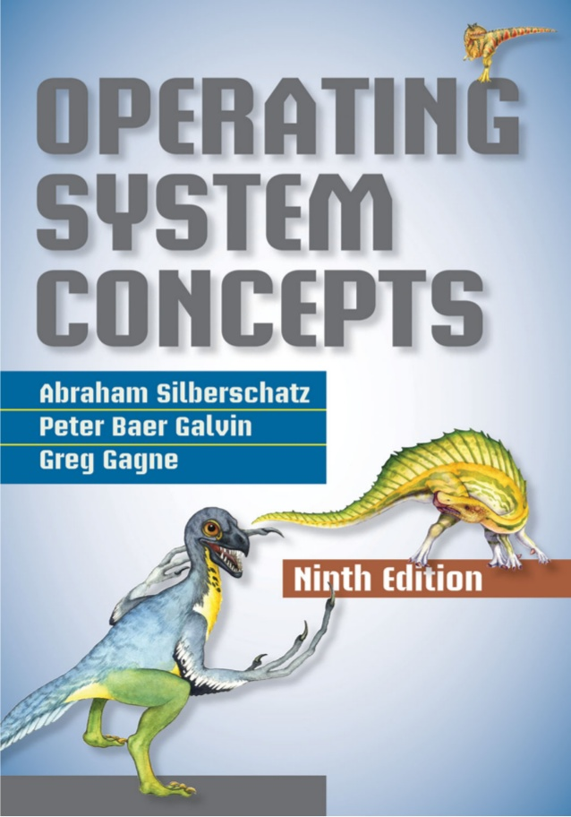

# Front-End Roadmap

## HTML

- [HTML & CSS (Begginer) (Paid) ](https://www.udemy.com/course/design-and-develop-a-killer-website-with-html5-and-css3/) - You will learn the basics pf HTML and CSS, With an intro to reponsive design
- [HTML & CSS (Intermediate) (Paid) ](https://www.udemy.com/course/advanced-css-and-sass/) - as a frontend developer you may work on a costumized theme and interface for your company brand, you need to have the skills needed to implement reponsive and high qulaity interfaces.
- [Semantic HTML (Free)](https://www.jungledisk.com/blog/2017/12/04/should-i-bother-with-semantic-html/) - Semantic HTML is really important for accessibility and SEO reasons.
- [A friendly web development tutorial for complete beginners](https://www.internetingishard.com/)
- [Standardista: CSS3, JS & HTML5 explained](http://www.standardista.com/) - a blog about web standards and performance

## CSS

- [CSS Tricks (Free)](https://css-tricks.com/) - the best website for staying up-to-date with css.
- [CSS Grids and Flexbox for Responsive Web Design (Paid)](https://frontendmasters.com/courses/css-grids-flexbox/) - in the old days there was no defined way of making grid systems, floats and table layout were hacking ways to create layout. Now we have great layout solitions which is flexbox and css grid.
- [BEM Naming Methodology ](http://getbem.com/naming/) - a great convention for naming classes.
- [Sass Crash Course (Free)](https://www.youtube.com/watch?v=nu5mdN2JIwM) - wrtiting your css with Sass pre-processor will make so much difference your development flow. I highly reccomend it
- [Sass Guidlines: 7-1 Architecture](https://sass-guidelin.es/) - let's say you are building a design system or a huge project. you need an architecture to increase maintainblity and the quality overall.
- [CSS State](https://2019.stateofcss.com/) - this is a helpful servey that shows the current state of CSS ecosystem
- [Motion Design with CSS by Val Head | OpenVis Conference 2015](https://www.youtube.com/watch?v=bkLw5YIkRXw)
- [Motion Design with CSS (Paid) (Intermediate)](https://frontendmasters.com/courses/motion-design-css/)
- [CSS Specification](https://www.w3.org/Style/CSS/specs.en.html) - just for reference
- [Even More CSS Secrets](https://www.youtube.com/watch?v=vs34f9FiHps) - CSS Secrets was a series of talks about some details of the language
- [ITCSS: Scalable and Maintainable CSS Architecture](https://www.xfive.co/blog/itcss-scalable-maintainable-css-architecture/) - it's another way of archetecting your css. I use 7-1 architecture + Sass + BEM for writing matintanable and scalable css
  - [OOCSS: Object Orianted CSS](https://www.keycdn.com/blog/oocss)
- [Web Fonts - The State of the Web](https://www.youtube.com/watch?v=L0xEOdybGFQ)
- [Responsive Web Design - What It Is And How To Use It](https://www.smashingmagazine.com/2011/01/guidelines-for-responsive-web-design/)
- [Responsive web design basics](https://web.dev/responsive-web-design-basics/)

## Design for developers

Your rule as front-end developer is not to design user interfaces but to build it. with that being said i highly reccomend that you get familier with UI design princiiple because you are going to implement UI/UX Designer [wireframes](https://www.justinmind.com/blog/low-fidelity-vs-high-fidelity-wireframing-is-paper-dead/).

- [The non-designer book by robin Williams](https://www.amazon.com/Non-Designers-Design-Book-4th/dp/0133966151)
- [Design for Developers](https://frontendmasters.com/courses/design-for-developers/)
- [Responsive Web Typography v2](https://frontendmasters.com/courses/responsive-typography-v2/) - typography is cruical for brands. it invoke certain feelings. this workshop is a great overview for typography.
- [The Best Resources For Designers In One Place](https://www.bookmarks.design/)
- [design-resources-for-developers](https://github.com/bradtraversy/design-resources-for-developers)
- [Motion design in UI - Designing in the Browser](https://www.youtube.com/watch?v=jWur1VrxNUg)
- [Contrast and Meaning](https://alistapart.com/article/contrastandmeaning/)
- [How To Design Better Buttons](https://www.smashingmagazine.com/2016/11/a-quick-guide-for-designing-better-buttons/)
- [FONT REVIEW JOURNAL](https://fontreviewjournal.com/)
- [Tim Brown — Universal Typography (SmashingConf NYC 2014)](https://vimeo.com/106504574)
- [Method of Action](https://method.ac/) - Method of Action creates tools, toys and games to help you learn design, for free.
- [Degreeless.design](https://www.degreeless.design/) - This is (almost) everything I learned in design school in one website

## Accessibility (a11y)

- [Web Content Accessibility Guidelines (WCAG) 2.0
  ](https://www.w3.org/TR/WCAG20/)
- [Webaim Checklist](https://webaim.org/standards/wcag/checklist#sc2.1.2) - this is a great guid to implement accility features as a developer. a small note here: this is meant to be a summary for developer not as a leggal reference.
- [Website Accessibility (Paid)](https://frontendmasters.com/courses/web-accessibility/) - a great workshop about the subject.
- [Accessibility Manifesto](http://accessibilitymanifesto.com/introduction)
- [Alt-texts: The Ultimate Guide](https://axesslab.com/alt-texts/)
- [Webaim Contrast Chcker](https://webaim.org/resources/contrastchecker/)
- [Accessible color palette builder](https://toolness.github.io/accessible-color-matrix/?n=white&n=light&n=bright&n=medium&n=dark&n=black&v=D81B60&v=B3EFFF&v=00CFFF&v=046B99&v=1C304A&v=000000)
- [Removing Headaches from Focus Management](https://developers.google.com/web/updates/2016/03/focus-start-point?hl=en) -[How and when to use the tabindex attribute](https://bitsofco.de/how-and-when-to-use-the-tabindex-attribute/)

## JavaScript

- [The Complete JavaScript Course (Paid)](https://www.udemy.com/course/the-complete-javascript-course) - You need to learn JavaScript very well before going to a framework/library like React or Anguler.
  - Basic syntax, ES5, ES6, DOM, AJAX
- [You Don't Know JS Yet (book series) - 2nd Edition (Intermediate) (Free) ](https://github.com/getify/You-Dont-Know-JS) - degging deeper into the language features such as prototypal inheritance, type system, engine, abstract syntax tree, closures, scope and so on.
  - [Deep JavaScript Foundations, v3 ](https://frontendmasters.com/courses/deep-javascript-v3/)
- [JavaScript: The Hard Parts, v2 (Paid)](https://frontendmasters.com/courses/javascript-hard-parts-v2/) - solid understanding of callbacks and higher-order functions, closure, asynchronous JavaScript, and object-oriented JavaScript.
- [JavaScript: From Fundamentals to Functional JS, v2
  (Paid)](https://frontendmasters.com/courses/js-fundamentals-functional-v2/)- deep dive into JavaScript and functional programming techniques
- [JavaScript State](https://2019.stateofjs.com/) - large survey about the javaScript ecosystem
- [Why Performance Matters](https://developers.google.com/web/fundamentals/performance/why-performance-matters/)
- [Mastering the Module Pattern](https://ultimatecourses.com/blog/mastering-the-module-pattern#private-methods)

## Build Systems

- [Gulpjs](https://gulpjs.com/) - automate slow, repetitive workflows and compose them into efficient build pipelines
- [PostCSS](https://postcss.org/) - I like using gulpjs for automation and combine it with the large ecosystem of plugins in postCSS.
- [The Difference Between Minification and Gzipping](https://css-tricks.com/the-difference-between-minification-and-gzipping/)
- [Build Tools](https://developers.google.com/web/tools/setup/setup-buildtools) - a little bit out of date article but it's realy good and informative

## Design Systems

- [A comprehensive guide to design systems](https://www.invisionapp.com/inside-design/guide-to-design-systems/)

## React

- [Atomic Design](https://bradfrost.com/blog/post/atomic-web-design/) - the web development industry is moving more towered a component-orianted way of developing user interfaces. this article will shows you how to think of components.
- [React Docs](https://reactjs.org/docs/getting-started.html) - the technical team of react did a great job with this docuemntation. the most important resource for learning React.
- [The Modern React Bootcamp (Hooks, Context, NextJS, Router)](https://www.udemy.com/course/modern-react-bootcamp/learn) - the best course for learning react
  - [Alternative](https://www.udemy.com/course/react-the-complete-guide-incl-redux/)
- [React Resources](https://reactresources.com/) - Articles, podcasts, conferences, books.
- [Dan Abramov Blog](https://overreacted.io/) - Dan is one of the main developers of Reactjs core team. This blog is not only about react but UI engineering in general.
- [React dev tools](https://chrome.google.com/webstore/detail/react-developer-tools/fmkadmapgofadopljbjfkapdkoienihi?hl=en)
- [State Management in Pure React, v2 (Paid)](https://frontendmasters.com/courses/pure-react-state/)

## Dev tools

- [Chrome DevTools](https://bitsofco.de/how-and-when-to-use-the-tabindex-attribute/)
- [Mastering Chrome Developer Tools v2](https://frontendmasters.com/courses/chrome-dev-tools-v2/)

## Package Managers

- [npm vs Yarn Commands Cheat Sheet](https://alligator.io/nodejs/npm-yarn-cheatsheet/)

## CSS in JS

- [styled component docs](https://styled-components.com/docs) - styled component is a new way of writing CSS. it enforces the idea of coupling the markup, styles and the javascript logic for each component. a great way of styling react and react native applications.
- [React Styled Components Tutorial](https://www.youtube.com/watch?v=syqw5UJrfoc)
- [The Top 205 Styled Components Open Source Projects](https://awesomeopensource.com/projects/styled-components)

## Git

- [BASIC GIT WORKFLOW](https://www.codecademy.com/learn/learn-git/modules/learn-git-git-workflow-u)
- [A Beginner’s Git and GitHub Tutorial](https://blog.udacity.com/2015/06/a-beginners-git-github-tutorial.html)
- [git-flow cheatsheet](https://danielkummer.github.io/git-flow-cheatsheet/)
- [Conventional Commits](https://www.conventionalcommits.org/en/v1.0.0-beta.4/#specification) - A specification for adding human and machine readable meaning to commit messages
- [Udacity Git Commit Message Style Guide](https://udacity.github.io/git-styleguide/)
- [Version Control with Git (Free) (Udacity)](https://www.udacity.com/course/version-control-with-git--ud123)
- [git - the simple guide](https://rogerdudler.github.io/git-guide/)

## Rendering on the web

- [Rendering on the Web](https://developers.google.com/web/updates/2019/02/rendering-on-the-web)
- [Client-side vs. Server-side vs. Pre-rendering for Web Apps](https://www.toptal.com/front-end/client-side-vs-server-side-pre-rendering)

## Performance

- [Front-end performance for web designers and front-end developers](https://csswizardry.com/2013/01/front-end-performance-for-web-designers-and-front-end-developers/#section:dns-prefetching)
- [REFLOWS & REPAINTS: CSS PERFORMANCE MAKING YOUR JAVASCRIPT SLOW?](http://www.stubbornella.org/content/2009/03/27/reflows-repaints-css-performance-making-your-javascript-slow/)
- [Avoid Large, Complex Layouts and Layout Thrashing
  ](https://developers.google.com/web/fundamentals/performance/rendering/avoid-large-complex-layouts-and-layout-thrashing)
- [Web Performance Optimisation, Consultancy, and Engineering
  ](https://csswizardry.com/)

## General Resources

- [Web Fundemntal (Google)](https://developers.google.com/web) - A great resource for learning the best standards and connvention in the modern web develpment
- [Frontend master books (Free)](https://frontendmasters.com/books/) - every year frontend masters publish a book that covers all topics in frontend development. I highly reccoemnd reading the frontend handbook 2019
- [Web.dev (Google)](https://web.dev/)
- [Full stack open 2020 ](https://fullstackopen.com/en/) - Free course by university of Helsini, The oldest and largest science university in Finland. the content of the course is very relative and modern.

## Web 101

- [How the web works](https://developer.mozilla.org/en-US/docs/Learn/Getting_started_with_the_web/How_the_Web_works) - How the web works provides a simplified view of what happens when you view a webpage in a web browser on your computer or phone
- [HTTP Status Codes in 60 Seconds](https://webdesign.tutsplus.com/tutorials/http-status-codes-in-60-seconds--cms-24317)
- [An Introduction to DNS Terminology, Components, and Concepts](https://www.digitalocean.com/community/tutorials/an-introduction-to-dns-terminology-components-and-concepts)
- [HTTP Fundamentals](https://www.pluralsight.com/courses/xhttp-fund)
- [Building Blocks of TCP](https://hpbn.co/building-blocks-of-tcp/#three-way-handshake)
- [HTTP Status Codes](https://httpstatuses.com/)

## Podcasts

- [Syntax: A Tasty Treats Podcast for Web Developers.](https://syntax.fm/)
- [Base.cs](https://dev.to/basecspodcast) - Computer Science podcast

## Certifications

### Udacity

- [Front-End Nanodegree](https://www.udacity.com/course/front-end-web-developer-nanodegree--nd0011)
  - [Syllabus](https://d20vrrgs8k4bvw.cloudfront.net/documents/en-US/Front+End+Web+Dev+-+nd0011+-+syllabus.pdf)
- [React Nanodegree](https://www.udacity.com/course/react-nanodegree--nd019)
  - [Syllabus](https://d20vrrgs8k4bvw.cloudfront.net/documents/en-US/reactnd-syllabus-3.0.pdf)

### Misk Academy

Misk academy deliver practical and career focused courses led by top-quality faculty aimed at equipping young Saudis and professionals with the skills needed.

- They regulerly post new certifications to enroll in. Don't mess it, it's a great chance for you to learn with a local community.
- [Misk Academy website](https://www.miskacademy.edu.sa/ | width=70)

### Saudi Digital Academy

A saudi initiative aimed to equipe young saudis with the skills needed in fields such as web/mobile development, Data Analysics, AI, and Game Devepment.

- [Website](https://sda.edu.sa/)

# Backend Roadmap

In the backend we are going to use nodejs which is an enviroment for executing javaascript on your machine.

## Nodejs

- [NodeJS - The Complete Guide (MVC, REST APIs, GraphQL, Deno)](https://www.udemy.com/course/nodejs-the-complete-guide/learn/lecture/11954326#overview)
- [MERN Stack Front To Back: Full Stack React, Redux & Node.js](https://www.udemy.com/course/mern-stack-front-to-back/)
- [Node.js, Express, MongoDB & More: The Complete Bootcamp 2020](https://www.udemy.com/course/nodejs-express-mongodb-bootcamp)
- [Events and Event Emitter in Node.js](https://www.youtube.com/watch?v=l20MBBFZAmA&feature=emb_title)
- [Understanding module.exports and exports in Node.js](https://www.sitepoint.com/understanding-module-exports-exports-node-js/)
- [Express/Node introduction](https://developer.mozilla.org/en-US/docs/Learn/Server-side/Express_Nodejs/Introduction)
- [Semantic Versioning](https://semver.org/)
- [2.5 cors, json, jsonp - undergrad webdev summer 1 2017
  ](https://www.youtube.com/watch?v=stvCHJZq5MI)

## Operating Systems : Operating system concepts 9th edition by Abraham Silbarschatz

## Relational Databases

- [PostgreSQL Tutorials](https://www.postgresqltutorial.com/) - A great website for learning SQL and postgreSQL

## NoSQL Databases

- [SQL vs NoSQL or MySQL vs MongoDB](https://www.youtube.com/watch?v=ZS_kXvOeQ5Y)
- [MongoDB Complete Introduction & Summary](https://www.youtube.com/watch?v=VELru-FCWDM)
- [Data Modeling Introduction](https://docs.mongodb.com/manual/core/data-modeling-introduction/)
- [Mongodb the Definitive Guide](https://www.amazon.co.uk/MongoDB-Definitive-Guide-Kristina-Chodorow/dp/1449344682) - A great book for learning MongoDB in a great details.
- [Data Modeling with MongoDB](https://www.youtube.com/watch?v=yuPjoC3jmPA)

## ORM: Mongoose

- [Mongoose docs](https://mongoosejs.com/docs/api.html)
- [MongoDB Tutorial - Modeling with MongoDB](https://www.youtube.com/watch?v=4rhKKFbbYT4&feature=emb_title)
- [MongoDB Crash Course](https://www.youtube.com/watch?v=-56x56UppqQ)

## Creating Restful APIs

- [What is REST](https://restfulapi.net/)
- [Web API design - Azure docs](https://docs.microsoft.com/en-us/azure/architecture/best-practices/api-design)
- [RESTful API Designing guidelines — The best practices](https://hackernoon.com/restful-api-designing-guidelines-the-best-practices-60e1d954e7c9#comment-4865610272)
- [REST API By Roy T.Fielding](https://roy.gbiv.com/untangled/2008/rest-apis-must-be-hypertext-driven)
- Error Handling in REST APIs
  - [Problem Details for HTTP APIs - RFC 7807](https://tools.ietf.org/html/rfc7807)
  - [Standard Error Responses - Google](https://developers.google.com/search-ads/v2/standard-error-responses)
  - [REST API Error Codes 101](https://blog.restcase.com/rest-api-error-codes-101/)
- [jsonapi](http://jsonapi.org/) - A SPECIFICATION FOR BUILDING APIS IN JSON
- [HTTP Crash Course & Exploration](https://www.youtube.com/watch?v=iYM2zFP3Zn0)

## Logging

- [A Guide to Node.js Logging
  ](https://www.twilio.com/blog/guide-node-js-logging)
- [The Cost of Logging - Matteo Collina, nearForm](https://www.youtube.com/watch?v=Dnx2SPdcDSU&t=820s)

## Validation

- [Input Validation on Client-side or Server-side?](https://www.packetlabs.net/input-validation/#:~:text=Input%20Validation%20on%20Server%2Dside&text=Using%20server%2Dside%20validation%20indicates,vulnerable%20to%20Cross%2DSite%20Scripting.&text=If%20a%20JavaScript%20payload%20of,the%20alert%20box%20will%20appear.)
- [express-validator
  6.6.0
  Docs
  API
  ](https://express-validator.github.io/docs/)
- [Express Tutorial Part 6: Working with forms
  ](https://developer.mozilla.org/en-US/docs/Learn/Server-side/Express_Nodejs/forms)

## Authentication

- [Everything You Ever Wanted to Know About Authentication
  ](https://www.youtube.com/watch?v=j8Yxff6L_po&feature=emb_title)
- [The JWT Handbook](https://www.fomasgroup.com/Portals/0/MgmNewsDocuments/jwt-handbook.pdf)
- [RFC 7519 JSON Web Token - RFC 7519 ](https://tools.ietf.org/html/rfc7519)
- [Everything You Ever Wanted to Know About Authentication](https://www.youtube.com/watch?v=j8Yxff6L_po&feature=emb_title)
- [OWASP® Foundation](https://owasp.org/) - Security for developers
- [Understanding cookies and sessions
  ](https://www.lynda.com/Node-js-tutorials/Understanding-cookies-sessions/798496/5028751-4.html)
- [Should you Implement Authentication Yourself?
  ](https://www.youtube.com/watch?v=Hh_kiZTTBr0&feature=emb_title)
- [Node.js API Authentication With JWT
  ](https://www.youtube.com/watch?v=7nafaH9SddU&t=232s)
- [Session Authentication vs Token Authentication](https://security.stackexchange.com/questions/81756/session-authentication-vs-token-authentication)
- [Getting, Setting, and Understanding Web Cookies using Express and WebdriverIO](https://spin.atomicobject.com/2018/09/26/setting-web-tracking-cookies/)
- [Authentication on the Web (Sessions, Cookies, JWT, localStorage, and more)
  ](https://www.youtube.com/watch?v=2PPSXonhIck&t=380s)
